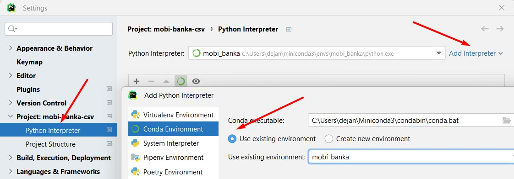

# Perfect python for windows - fluent, movable and efficient installation
## Setting up Windows 10/11 development environment for python development (winget, MiniConda, PyCharm, Windows Terminal, cloud storage)

This is short (and hopefully sweet :smile:) set of instructions for creating fast, efficient and highly operational enviroment for python development.

Given nature of today's development, it is expected that you develop same project from multiple locations (from Work office, from home, from travel laptop ...) and also that you need to bring new workplace very, very fast. Also, working from multiple locations and synhronising all of that can be very cumbersome and complicated.

That is basic reason for creating this set of instructions and scripts - to enable today's nomad developers to do real creative work w/o worrying too much about on which machine you are and which state you left project on previous work place.

Some assumptions:
* Operating system is Windows 10/11, fully patched.
  * Yes, I am perfectly aware that you can create brilliant working environments on Linux/Mac. However, I am perfectly happy with Windows and won't go into other operating systems here :upside_down_face:
* Online accounts needed:
  * [Github](https://github.com/) (projects, settings sync)
  * (optional) [MS Account](https://account.microsoft.com/account/manage-my-account) (MS Store applications, settings sync)
  * (optional) [JetBrains Account](https://account.jetbrains.com/) (PyCharm settings sync)
* Additional software from MS Store (= one time install, tied to MS Account, easy to install on other machine, auto-update):
  * [Windows Terminal](https://www.microsoft.com/store/productId/9N0DX20HK701)
  * [App Installer (WinGet)](https://www.microsoft.com/store/productId/9NBLGGH4NNS1) - great CLI (command line) application for managing applications
  * (optional) [DBeaver CE](https://www.microsoft.com/store/productId/9PNKDR50694P) - efficient multi-database management/development tool
  * (optional) [Visual Studio Code](https://apps.microsoft.com/store/detail/XP9KHM4BK9FZ7Q) - while PyCharm is for full python development, VS Code is great all-round multi-purpose editor
  * (optional) [PowerToys](https://apps.microsoft.com/store/detail/XP89DCGQ3K6VLD) - excellent FancyZones are great help with wide monitors and better usage of display space
* Rest of mandatory software:
  * [MiniConda](https://docs.conda.io/en/latest/miniconda.html) (installation: `winget install -e --id Anaconda.Miniconda3`)
* Rest of highly recommended software:
  * [7zip](https://www.7-zip.org/) (installation: `winget install -e --id 7zip.7zip`)
  * [WGet](https://eternallybored.org/misc/wget/) (installation: `winget install -e --id GnuWin32.Wget`)
  * [WinMerge](https://winmerge.org/) (installation: `winget install -e --id WinMerge.WinMerge`)
  * [Lightshot](https://app.prntscr.com/en/) (installation: `winget install -e --id Skillbrains.Lightshot`)

(all of above winget installations are in [this file](./winget-installs.cmd))

If you want to more general approach, to copy exact state of winget installed applications from one machine to another, suggest to use:
* From old machine: `winget export -o .\winget-export.json`
* (inspect json file, make changes if needed)
* To new machine: `winget import -i .\winget-export.json --accept-package-agreements`

Finally, working with python is tightly coupled with CMD/Windows terminal prompt; one great resource for that is [FiraCode](https://github.com/tonsky/FiraCode) font, monospaced font for development.

Install it last, after all other software and then [enable ligatures](https://github.com/tonsky/FiraCode/wiki#enabling-ligatures) for Windows Terminal, VS Code and PyCharm.

## MiniConda
There are many ways to separate various python applications and/or environments. IMHO, [MiniConda](https://docs.conda.io/en/latest/miniconda.html) is most versatile and provide significant advantage over others: you can work with multiple python versions on same machine w/o conflict.

All below assumes that you *opened MiniConda CMD or PowerShell prompt* and working from there.

### Creating new python environment
In order to create environment, you need _env_name_ and python _version_:

#### Blank one

Create Conda environment:
`conda create --name env_name python=3.10`

#### Existing one (GitHub)
Above instruction is for completely new environment; for existing projects on Github:
* move to parent folder
* clone project from GitHub (example: `git clone https://github.com/dvesic/perfect-python-4-windows`)
* move to newly created folder
* execute `bin\create.cmd` - that will recreate previosly frozen Conda environment
* activate environment (`conda activate name_of_env`)
* execute `bin\auto_cd_folder.cmd`
  * this will create appropriate _set_working_directory.bat_ in conda _envs\name_of_env\etc\conda\activate.d_ folder
  * going forward, each subsequent activation of environment will also move you to appropriate folder as well

Now you have new Conda environment, and project downloaded. Open project in PyCharm, and set python interperter to newly created Conda environment:
* File/Settings (Ctrl-Alt-S)
* Project/Python Interpreter:


### Activating/deactivating python environment

Each project should have its own _target_directory_; once that done, it is very convenient to automaticaly switch to appropriate drive/folder on environment activation.

For reference, activation and deactivation of environment is simple:
```
conda activate name_of_env
conda deactivate
```
## PyCharm

While Visual Studio Code is great, I still prefer [JetBrains PyCharm](https://www.jetbrains.com/pycharm/) as main python DEV IDE - you can do all things needed for small to large python project.

You can choose between free, Community edition and paid Professional edition. 

Installations (in **Elevated admin console**):
* Professional edition: `winget install -e --id JetBrains.PyCharm.Professional`
* Community edition: `winget install -e --id JetBrains.PyCharm.Community`

I strongly suggest creating JetBrains account and using it for syncing configuration between multiple PyCharm instances (Settings / Settings Sync)

## Keeping things up to date

Last, but not least - please keep your full environment up to date :-)

* Windows - at least monthly, make sure that all updates are installed and applied
* MS Store - at least monthly, update all applications, if those are not updated already
* MiniConda: open Conda prompt (over Windows Terminal) and: `conda update -n base -c defaults conda`
* WinGet applications: open (**Elevated admin console**) console and: `winget upgrade --all`